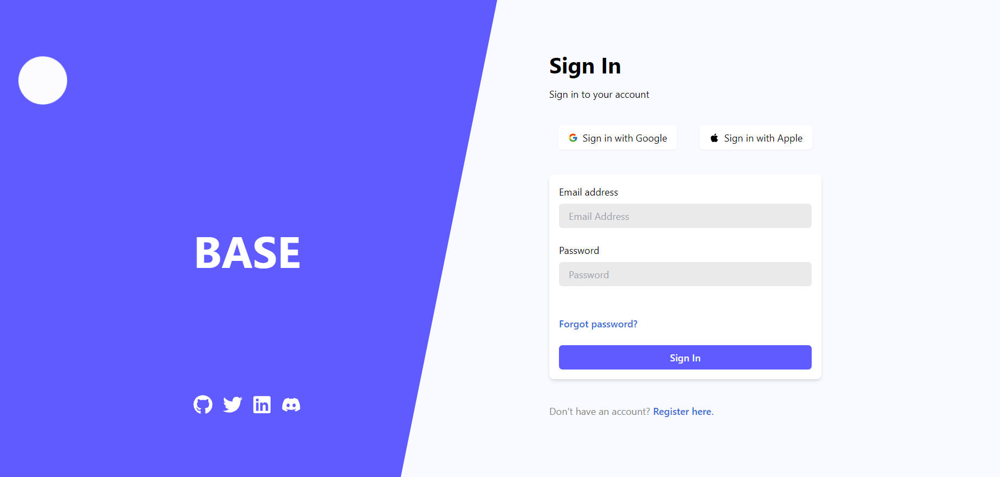
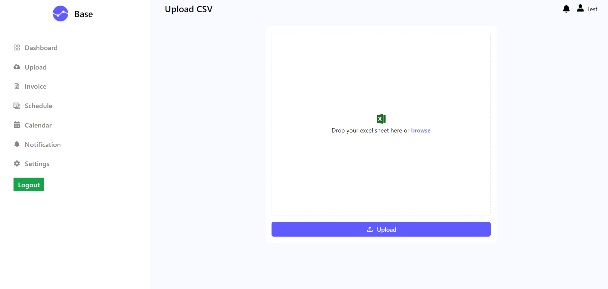
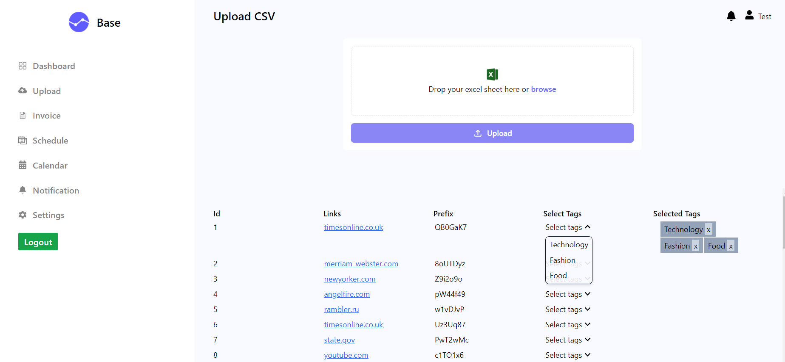

# Assignment

In the project directory, you can run:

### `npm start`

Runs the app in the development mode.\
Open [http://localhost:3000](http://localhost:3000) to view it in your browser.

### Login credentials:

(Bypass if any dangerous message pops up.)
Email: test@gmail.com
Password: Test@123
